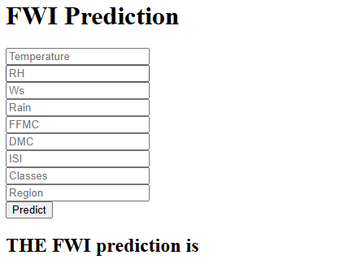

# Algerian Forest Fire Prediction System 🔥

A Machine Learning web application that predicts the **Fire Weather Index (FWI)** for Algerian forest fire data using **Ridge Regression** and **Flask**.

---

# 📌 Project Overview

This project predicts the Fire Weather Index (FWI) based on environmental and weather conditions such as:

- Temperature
- Relative Humidity (RH)
- Wind Speed (Ws)
- Rain
- FFMC
- DMC
- ISI
- Classes
- Region

The application is built using:

- Python
- Flask
- Scikit-Learn
- Ridge Regression
- HTML/CSS

---

# 🚀 Features

✅ Predict Forest Fire Weather Index  
✅ Ridge Regression ML Model  
✅ StandardScaler preprocessing  
✅ Flask Web Application  
✅ User-friendly HTML frontend  

---

# 🛠️ Tech Stack

| Technology | Usage |
|---|---|
| Python | Backend |
| Flask | Web Framework |
| Scikit-Learn | Machine Learning |
| Pandas | Data Processing |
| NumPy | Numerical Operations |
| HTML/CSS | Frontend |

---

# 📂 Project Structure
forestfire-main/
│
├── images/
│   ├── home.png
│   └── preidicted.png
│
├── models/
│   ├── ridge.pkl
│   └── scaler.pkl
│
├── notebooks and dataset/
│   ├── Algerian_forest_fires_cleaned_dataset.csv
│   └── ALGERIAN_MODEL_TRAINING.ipynb
│
├── templates/
│   ├── home.html
│   └── index.html
│
├── application.py
├── readme.md
└── req.txt

📊 Dataset
Dataset used: Algerian Forest Fires Dataset

Features include:
Temperature
RH
Ws
Rain
FFMC
DMC
ISI
Classes
Region

Target:
FWI (Fire Weather Index)

⚙️ Installation
Clone Repository
git clone https://github.com/yourusername/forestfire-main.git
Navigate to Project Folder
cd forestfire-main
Install Dependencies
pip install -r req.txt
▶️ Run Flask App
python application.py

Application runs on:
http://127.0.0.1:5000

🧠 Machine Learning Workflow
Data Collection
Data Cleaning
Feature Scaling using StandardScaler
Train-Test Split
Ridge Regression Model Training
Model Serialization using Pickle
Flask Deployment

📈 Model Used
Ridge Regression
Ridge Regression is a regularized version of Linear Regression used to reduce overfitting.
Formula:
Ridge Loss Function: L = RSS + λ(Σβ²)
Where:
RSS = Residual Sum of Squares
λ = Regularization Parameter

📸 Screenshots
Home Page
# 📸 Screenshots
## Home Page

## Prediction Output

📦 Requirements
Main Libraries:
Flask
numpy
pandas
scikit-learn
pickle
👨‍💻 Author

Developed by:
Mohammed Ghouse D

⭐ Future Improvements
Deploy on AWS / Render / Heroku
Add Bootstrap UI
Add Graph Visualizations
Add Multiple ML Models
Docker Support
📜 License

This project is open-source and available under the MIT License.